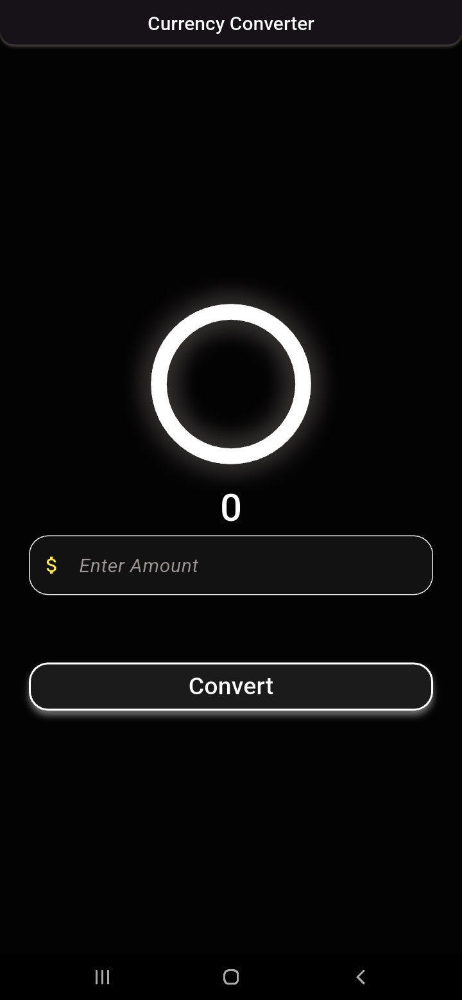

# Currency Converter

A simple and efficient Flutter application to 
convert currency values. This project demonstrates the implementation 
of both Material (Android) and Cupertino (iOS) design styles in a single codebase.

## App Preview

## Features
- **Dual Design**: Supports both Material Design and Cupertino UI.
- **Real-time Reset**: The result resets automatically as soon as you start typing a new value.
- **Dismiss Keyboard**: Tap anywhere on the screen to hide the keyboard.
- **Safe Input**: Numeric-only keyboard with decimal support and crash-proof parsing.

## Download
You can download the ready-to-install application file here:
- [**Download app-release.apk**](release/app-release.apk)

---
**ps: Trying Flutter, First Project**
